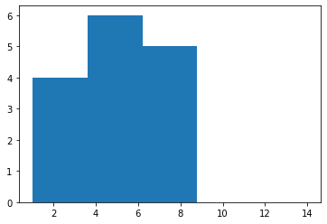
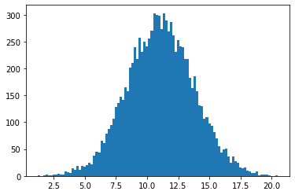
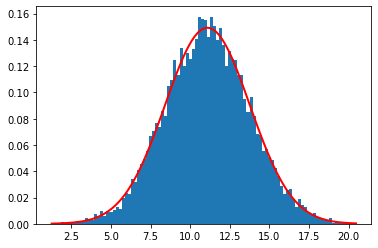

# Lab 1: Introdução ao Jupyter notebook
Neste notebook veremos uma breve introdução ao ambiente [Jupyter](https://jupyter.org/) e a linguagem [Python](https://docs.python.org/pt-br/3.7/tutorial/index.html). Veremos também como utilizar alguns elementos básicos de interesse do nosso curso. Como, por exemplo, expressar números complexos, vetores e matrizes, além de escrever e usar funções matemáticas e produzir gráficos em Python. 

Na próxima aula prática, veremos como usar ferramentas de computação algébrica, com expressões analíticas.

<hr>

## Notebook Basics
O _Jupyter notebook_ permite reunir num mesmo documento um ambiente interativo com **textos** e **fórmulas matemáticas**, **figuras** e **gráficos**, **código em Python** (ou outras linguagens), **código HTML** e **widgets interativos**, tudo num só lugar, interagindo de forma integral. É ótimo tanto para testar e explorar ideias, como comunicá-las a outras pessoas.

Para ter informaçãos de como funciona o ambiente do notebook Jupyter, acesse os links:

- [What is Jupyter Notebook](https://nbviewer.jupyter.org/github/jupyter/notebook/blob/master/docs/source/examples/Notebook/What%20is%20the%20Jupyter%20Notebook.ipynb)
- [Notebook basics](https://nbviewer.jupyter.org/github/jupyter/notebook/blob/master/docs/source/examples/Notebook/Notebook%20Basics.ipynb)
- [Working with Markdown cells](https://nbviewer.jupyter.org/github/jupyter/notebook/blob/master/docs/source/examples/Notebook/Working%20With%20Markdown%20Cells.ipynb)
- [Typesetting Equations (with LaTeX)](https://nbviewer.jupyter.org/github/jupyter/notebook/blob/master/docs/source/examples/Notebook/Typesetting%20Equations.ipynb)

Para facilitar, ainda mais e também permitir você explorar/modificar os códigos fontes, eu incluí uma cópia do diretórios de exemplos aqui, na sua área neste servidor. Basta procurar o diretório **Jupyter_Tutorial/examples/Notebook** no diretório principal, quando você faz o _login_ neste servidor. Alternativamente, poderá acessar esse exemplos no [GitHub](https://github.com/jupyter/notebook/tree/master/docs/source/examples/Notebook).

Não deixe de acessar e explorar o link acima (além de acessar o código neste servidor, você pode baixar o _notebook_ e explorar o código localmente, para entender seus elementos -- é uma ótima forma de aprender rapidamente!). Para acessar o Jupyter (Python) no seu computador (localmente), eu recomendo instalar a distribuição [Anaconda](https://www.anaconda.com/products/individual).

A seguir nós iremos nos concentra em como usar esse ambiente para as atividades e tarefas desta disciplina.
<hr>

## Números e operações básicas
Python é uma linguagem interpretada, em contraste com liguagens compiladas, o que significa que, além de gerar programas (scripts) você também pode interagir diretamente com o interpretador e, por exemplo, fazer cáculos como numa calculadora. 


```python
3+4
```


    7


```python
3*7
```


    21


```python
7/3
```


    2.3333333333333335


```python
7//3  #divisão inteira
```


    2


### Números complexos


```python
 3 + 4j
```


    (3+4j)


```python
(3+4j)+(7+3j)
```


    (10+7j)


```python
(3+4j)*(7+3j)+511
```


    (520+37j)


Podemos definir variáveis, atribuindo valores numéricos (tanto reais, como complexos) a essas variáveis 


```python
r = 7
z = 3 + 4j
z
```


    (3+4j)


Usando o método **.conjugate()** é possível acessar o complexo cojugado do valor associado a uma variável.


```python
z.conjugate()
```


    (3-4j)


```python
r.conjugate()
```


    7


(😃) **Variáveis dinâmicas:** em Python a atribuição de variáveis é feita dinamicamente, no sentido que o tipo da variável <br>(i.e., como ela é armazenada internamente na memória) é determinado automaticamente, dependo do valor atribuído a ela. <br>Por isso não é necessário escolher _a priori_ o tipo da variável. É só usar...  ( _mas tome cuidado!_ )

### Listas


```python
lista = [1, 4, 9, 16, 25]  # atribui a lista a uma variável
lista  #mostra os resultados (valor da variável)
```


    [1, 4, 9, 16, 25]


Você pode acessar e "manipular" os valores dos elementos na lista, usando seu índice. Os índices em Python sempre começam no elemento "zero"...


```python
lista[2]  # acessa o terceiro elemento da lista
```


    9


```python
lista[0]  # este é o primeiro elemento
```


    1


```python
lista[-1]  # e este, consegue imaginar?? 
```


    25


Listas podem ter diferentes tipos de elementos, não apenas números:


```python
lista2 = ['a', 'b', 'c', 'd','texto também pode!','😉','👍😃✌']
lista + lista2  # o que será que vai sair disso?? (que operação é essa?)
```


    [1, 4, 9, 16, 25, 'a', 'b', 'c', 'd', 'texto também pode!', '😉', '👍😃✌']


Para mais informações sobre como usar listas, acesse este [link para o tutorial do Python](https://docs.python.org/3.7/tutorial/introduction.html#lists).

 <hr>

## Estendendo a funcionalidade com bibliotecas
A linguagem Python tem um número gigantesco de  **bibliotecas** (extensões da linguagem) especializadas em tarefas específicas. Elas aumentam muito o funcionalidade e os recursos da liguagem. Além da [Biblioteca Padrão](https://docs.python.org/pt-br/3.7/library/index.html#library-index), existe um grande número de bibliotecas produzidas pela comunidade de código aberto, especialmente na [área científica](https://scipy.org). 

A filosofia da liguagem é diferene de várias outras liguagens, mantendo apenas um _core_ (núcleo) mínimo de palavras reservadas ("keywords" e [identificadores](https://docs.python.org/pt-br/3.7/reference/lexical_analysis.html#identifiers)), deixando funcionalidades mais específicas para essas bibliotecas especializadas. Assim, especialmente para o uso científico do Python, nós precisaremo usar essas extensões. 

Usaremos várias delas ao longo deste curso, principalmente [Numpy](https://numpy.org/doc/stable/user/index.html), [Scipy](https://scipy.org/), [Matplotlib](https://matplotlib.org/) e [SymPy](https://www.sympy.org/en/index.html), além, claro do próprio Jupyter, que também é uma extensão da linguagem, como resultado da evolução do [IPython](https://ipython.org/). 

Abaixo eu mostro como carregar algumas delas.


```python
from numpy import array, dot, outer, sqrt, matrix, linspace, sin, cos
from numpy.linalg import eig, eigvals
from matplotlib.pyplot import hist, plot
%matplotlib inline
```

Outra forma de fazer isso é:


```python
import numpy as np        # aqui atribui-se um "apelido" ('alias') para o nome da biblioteca
import numpy.linalg as la
```

### Vetores
Praticamente toda linguagem de programação possui algum tipo de estrutura para armazenar dados de um determinado tipo (geralmente números, mas também caracteres). Geralmente são chamados de "**arrays**" (que no caso do Python, estão na biblioteca [Numpy](https://numpy.org/doc/stable/), que foi carregado acima). No nosso idioma eles são normalmente traduzido como "vetores". <br>
Esses vetores são parecidos, mas _nem sempre equivalentes_ , ao conceito de vetores usado na Física ou na Algebra Linear.

Podemos, porém, definir e usar formalmente algo análogo aos vetores que temos usado neste curso, mesmo no sentido de espaços vetorias complexos...

Abaixo eu mostro como definir vetores **linhas** e **colunas**, como os usados na MQ.


```python
vl = array([1,2,3])  # um vetor linha
vl
```


    array([1, 2, 3])


```python
vc = array([[4],[5],[6]])  # um vetor coluna
vc
```


    array([[4],
           [5],
           [6]])


```python
dot(vl,vc) # produto escalar (produto interno): retorna um escalar
```


    array([32])


```python
dot(vc,vl)  # CUIDADO!! A ordem faz diferença... (porque??!)
```


    ---------------------------------------------------------------------------

    ValueError                                Traceback (most recent call last)

    <ipython-input-21-84108f792119> in <module>
    ----> 1 dot(vc,vl)  # CUIDADO!! A ordem faz diferença... (porque??!)
    

    <__array_function__ internals> in dot(*args, **kwargs)
    

    ValueError: shapes (3,1) and (3,) not aligned: 1 (dim 1) != 3 (dim 0)


```python
outer (vc,vl)  # retorna um operador linear (não um escalar!)
```


    array([[ 4,  8, 12],
           [ 5, 10, 15],
           [ 6, 12, 18]])


```python
outer (vl,vc) # note que a ordem dos vetores mudou, assim como a matriz do operador (como?)
```


    array([[ 4,  5,  6],
           [ 8, 10, 12],
           [12, 15, 18]])


### Vetores de números complexos (como no espaço de Hilbert)


```python
v1 = array([1+2j, 3+2j, 5+1j, 4+0j])
```


```python
v1*v1  # produto (direto) de dois vetores complexos (você entendeu o resultado??!)
```


    array([-3. +4.j,  5.+12.j, 24.+10.j, 16. +0.j])


```python
v1*v1.conjugate()  # multiplicando pelo complexo conjutado (retorna um real)
```


    array([ 5.+0.j, 13.+0.j, 26.+0.j, 16.+0.j])


```python
(1+2j)*(1+2j)
```


    (-3+4j)


```python
dot(v1.conjugate(),v1)   # use o dot() para obter o produtor interno (escalar)
```


    (60+0j)


### Matrizes
Podemos também, claro, definir matrizes, que são objetos muito importantes neste curso. Na linguagem Python (usando a Numpy), podemos definir matrizes de duas formas. Uma é usando o mesmo comando **array**, que, na verdade, funciona para "vetores multdimensionais" dentro da linguagem. A outra forma será mostrada também nos exemplos.


```python
# a two-dimensional array
m1 = array([[1,0],[1,2]])
m1
```


    array([[1, 0],
           [1, 2]])


```python
# pode calcular a matriz transpostas, com o método T
m1.T
```


    array([[1, 1],
           [0, 2]])


```python
# podemos também calcular (facilmente!) os autovalores e autovetores!! 
eig(m1)
```


    (array([2., 1.]),
     array([[ 0.        ,  0.70710678],
            [ 1.        , -0.70710678]]))


```python
# é fácil verificar o resultado também
dot(m1,array([ 0, 1]))
```


    array([0, 2])


### Buscando ajuda com os comandos "_?_"  e " _help()_ " 


```python
# use o sinal de interrogação para acessar o comando help() 
eig?
```


```python
# assim também funciona... (mas o resultado é diferente)
help(eig)
```
   
    Help on function eig in module numpy.linalg:
    
    eig(a)
        Compute the eigenvalues and right eigenvectors of a square array.
        
        Parameters
        ----------
        a : (..., M, M) array
            Matrices for which the eigenvalues and right eigenvectors will
            be computed
        
        Returns
        -------
        w : (..., M) array
            The eigenvalues, each repeated according to its multiplicity.
            The eigenvalues are not necessarily ordered. The resulting
            array will be of complex type, unless the imaginary part is
            zero in which case it will be cast to a real type. When `a`
            is real the resulting eigenvalues will be real (0 imaginary
            part) or occur in conjugate pairs
        
        v : (..., M, M) array
            The normalized (unit "length") eigenvectors, such that the
            column ``v[:,i]`` is the eigenvector corresponding to the
            eigenvalue ``w[i]``.
        
        Raises
        ------
        LinAlgError
            If the eigenvalue computation does not converge.
        
        See Also
        --------
        eigvals : eigenvalues of a non-symmetric array.
        
        eigh : eigenvalues and eigenvectors of a real symmetric or complex
               Hermitian (conjugate symmetric) array.
        
        eigvalsh : eigenvalues of a real symmetric or complex Hermitian
                   (conjugate symmetric) array.
        
        Notes
        -----
        
        .. versionadded:: 1.8.0
        
        Broadcasting rules apply, see the `numpy.linalg` documentation for
        details.
        
        This is implemented using the ``_geev`` LAPACK routines which compute
        the eigenvalues and eigenvectors of general square arrays.
        
        The number `w` is an eigenvalue of `a` if there exists a vector
        `v` such that ``dot(a,v) = w * v``. Thus, the arrays `a`, `w`, and
        `v` satisfy the equations ``dot(a[:,:], v[:,i]) = w[i] * v[:,i]``
        for :math:`i \in \{0,...,M-1\}`.
        
        The array `v` of eigenvectors may not be of maximum rank, that is, some
        of the columns may be linearly dependent, although round-off error may
        obscure that fact. If the eigenvalues are all different, then theoretically
        the eigenvectors are linearly independent. Likewise, the (complex-valued)
        matrix of eigenvectors `v` is unitary if the matrix `a` is normal, i.e.,
        if ``dot(a, a.H) = dot(a.H, a)``, where `a.H` denotes the conjugate
        transpose of `a`.
        
        Finally, it is emphasized that `v` consists of the *right* (as in
        right-hand side) eigenvectors of `a`.  A vector `y` satisfying
        ``dot(y.T, a) = z * y.T`` for some number `z` is called a *left*
        eigenvector of `a`, and, in general, the left and right eigenvectors
        of a matrix are not necessarily the (perhaps conjugate) transposes
        of each other.
        
        References
        ----------
        G. Strang, *Linear Algebra and Its Applications*, 2nd Ed., Orlando, FL,
        Academic Press, Inc., 1980, Various pp.
        
        Examples
        --------
        >>> from numpy import linalg as LA
        
        (Almost) trivial example with real e-values and e-vectors.
        
        >>> w, v = LA.eig(np.diag((1, 2, 3)))
        >>> w; v
        array([1., 2., 3.])
        array([[1., 0., 0.],
               [0., 1., 0.],
               [0., 0., 1.]])
        
        Real matrix possessing complex e-values and e-vectors; note that the
        e-values are complex conjugates of each other.
        
        >>> w, v = LA.eig(np.array([[1, -1], [1, 1]]))
        >>> w; v
        array([1.+1.j, 1.-1.j])
        array([[0.70710678+0.j        , 0.70710678-0.j        ],
               [0.        -0.70710678j, 0.        +0.70710678j]])
        
        Complex-valued matrix with real e-values (but complex-valued e-vectors);
        note that ``a.conj().T == a``, i.e., `a` is Hermitian.
        
        >>> a = np.array([[1, 1j], [-1j, 1]])
        >>> w, v = LA.eig(a)
        >>> w; v
        array([2.+0.j, 0.+0.j])
        array([[ 0.        +0.70710678j,  0.70710678+0.j        ], # may vary
               [ 0.70710678+0.j        , -0.        +0.70710678j]])
        
        Be careful about round-off error!
        
        >>> a = np.array([[1 + 1e-9, 0], [0, 1 - 1e-9]])
        >>> # Theor. e-values are 1 +/- 1e-9
        >>> w, v = LA.eig(a)
        >>> w; v
        array([1., 1.])
        array([[1., 0.],
               [0., 1.]])


<hr>
<hr>

## Exemplos e exercícios para praticar

### Exemplo 1

Lembra aquele exemplo...

$$
M = \begin{pmatrix} 1 & 2 \\ 1 & 0 \end{pmatrix}
$$


```python
M = matrix([[1,2],[1,0]])
M
```


    matrix([[1, 2],
            [1, 0]])


Quais os autovalores e autovetores? 


```python
eig(M)
```


    (array([ 2., -1.]),
     matrix([[ 0.89442719, -0.70710678],
             [ 0.4472136 ,  0.70710678]]))


Vamos explorar os elementos desse objeto, atribuindo-o a uma variável.


```python
autos = eig(M)
```

Ao fazer isso, a função eig(M) retorna um objeto diferente dos que vimos até agora, chamado **Tuple**. Esse objeto é também uma coleção de elementos ordenados, parecido com uma lista, mas é indicado pelo símbolo de parênteses, ao invés dos colchetes. Podemos acessar os elementos de um **tuple**, de forma parecida com as **listas** e **arrays**. Veja os exemplos:


```python
autos[0]
```


    array([ 2., -1.])


```python
autos[1]
```


    matrix([[ 0.89442719, -0.70710678],
            [ 0.4472136 ,  0.70710678]])


Observer que este elemento (o segundo elemento do tuple) é uma matriz Numpy. Seus elementos podem ser acessados como qualquer matriz (ou array) no numpy. Por exemplo, para acessar o primeiro vetor linha


```python
autos[1][0]
```


    matrix([[ 0.89442719, -0.70710678]])


```python
dot(autos[1][0],M)  # multiplicação à esquerda de um vetor linha pelo operador M
```


    matrix([[0.18732041, 1.78885438]])


Você já deve ter notado que **eig(M)** retorna os autovalores de **M**, no primeiro elemento do tuple, e os autovetores, no segundo elemento do tuple. Os autovetores estão na forma de vetores colunas.


```python
autoV = autos[1]   # transpondo a matriz
autoV
```


    matrix([[ 0.89442719, -0.70710678],
            [ 0.4472136 ,  0.70710678]])


podemos calcular a norma dos vetores colunas através do método **numpy.linalg.norm()**, que aqui pode ser acessado de uma forma abrevidas, pois já carregamos essa numpy.linalg com o alias  "$\textrm{la}$"


```python
la.norm(autoV.T[1])
```


    1.0


Talvez lhe seja mais familiar, se divindo por $\sqrt2$ e $\sqrt5$ (fatorando esses termos), como fizemos nas aulas.


```python
autoV.T[1].T/sqrt(2)
```


    matrix([[-0.5],
            [ 0.5]])


```python
autoV.T[0].T/sqrt(5)
```


    matrix([[0.4],
            [0.2]])


podemos agora testar se os autovetores estão corretos, aplicando o operador sobre eles


```python
dot(M,autoV.T[1].T)/sqrt(2)  # resulta no autovetor multplicado por seu autovalor
```


    matrix([[ 0.5],
            [-0.5]])


```python
dot(M,autoV.T[0].T)/sqrt(5)  # resulta no autovetor multplicado por seu autovalor
```


    matrix([[0.8],
            [0.4]])


Vale lembrar que um autovetor continua sendo um autovetor quando multiplicado por um escalar (a direção não muda!), portanto fatores multiplicativos não são relevanes para autovetores. Você pode observar, por exemplo, que o o primeiro autovetores acima, tem um fator de 2 com relação ao que havíamos determinado manualmente, na aula. 


**Transformação de similaridade**

Podemos faze mais um exemplo de uso desse rescusos para demostrar o método de diagonalização discutido nas últimas aulas. Vimos que a a transformação **S** pode ser construída com os autovetores do operador (neste caso, a matriz **M**). Neste caso, a matriz **S** será exatamente a matriz autoV, calculada acima...


```python
S = autoV
Si = la.inv(S)  # calcula a matriz inversa

dot(Si,dot(M,S))
```


    matrix([[ 2.00000000e+00,  2.22044605e-16],
            [ 0.00000000e+00, -1.00000000e+00]])


```python
# você pode "limpar" os erros numéricos de arredondamento, se preferir
dot(Si,dot(M,S)).round()
```


    matrix([[ 2.,  0.],
            [ 0., -1.]])


Onde podemos ver que a matriz está agora na forma sua forma diagonal.  😉

<hr>


### Exemplo 2

Para praticar um pouco, agora é sua vez! Vamos usar as matrizes do **Problema 3**  da **Lista 3**:

$$
A=
\begin{pmatrix}
-1 & 2i & 0 \\
 0 &  4 & 0 \\
 1 &  0 & 1
\end{pmatrix}
$$

$$
B=
\begin{pmatrix}
 0 & 2  & i \\
-i & 2i & 0 \\
 0 &  1 & 4
\end{pmatrix}
$$


**Agora é sua vez:** comece escrevendo essas matriz num formato que a linguagem Python entenda. 


```python

```

Depois calcule as duas **inversas** (na lista foi pedido apenas de A) e **verifique se elas comutam**.


```python

```

Percebe agora os " **super poderes** " que isso te dá?? 

Poderia ser uma matriz de 10x10 ou 1000x1000 que o $\underline{seu}$ trabalho seria essencialmente o mesmo! 😉

_Numpy_ faria todo o trabalho pesado para você!! Parece-me motivação suficiente para aprender usar, não? 

<hr>


### Exemplo 3

Como último exemplo, vamos considerar agora o uma aplicação de distribuição estatística. Por exemplo, considere que foram feitas várias medidas de um observável o resultado é dado por uma lista de valores, como a abaixo.


```python
m = [10,13,14,14,6,8,7,9,12,14,13,11,10,7,7]
vetor = array(m)/2    #importante converter para array primeiro!
print(m)
print(vetor)   # usando a função print() para mostrar os valores das variáveis m e vetor
```

    [10, 13, 14, 14, 6, 8, 7, 9, 12, 14, 13, 11, 10, 7, 7]
    [5.  6.5 7.  7.  3.  4.  3.5 4.5 6.  7.  6.5 5.5 5.  3.5 3.5]
    


```python
# podemos construi um histograma das medidas usando a função hist()
n1, bins1, patches1 = hist(m,bins=5,range=(5,14))
```





```python
# a frequência (# de ocorrências) em cada bin é dada por
n1
```


    array([1., 4., 3., 2., 5.])


```python
# observe que m é uma lista enquanto vetor é um array, mas isso não faz diferença p/ hist()
n2, bins2, patches2 = hist(vetor,bins=5,range=(1,14))
```


```python
n2
```


    array([4., 6., 5., 0., 0.])


Podemos agora facilmente calcular a probabilidade (a partir das medidas, não a teórica) dos resultados dessas medidas.


```python
pvals1 = n1/n1.sum()
pvals1
```


    array([0.06666667, 0.26666667, 0.2       , 0.13333333, 0.33333333])


```python
pvals2 = n2/n2.sum()
pvals2
```


    array([0.26666667, 0.4       , 0.33333333, 0.        , 0.        ])


```python
# note que as somas estão normalizadas...
print("A soma de todas as probabilidades pvals1 =",np.sum(pvals1))
print("A soma de todas as probabilidades pvals2 =",np.sum(pvals2))
```

    A soma de todas as probabilidades pvals1 = 1.0
    A soma de todas as probabilidades pvals2 = 1.0
    

Vamos nos aprofundar um pouco mais nisso, pois vale a pena...


```python
# o valore médio de <m>
m =  2*vetor 
sm = m.sum()
sm
```


    155.0


```python
np.sum(m)
```


    155.0


```python
p = 2*vetor/sm
m1 = dot(p,m)  # <m> : valor médio de m
m1
```


    11.09032258064516


$$
\langle m \rangle = \sum_i p_i\ m_i
$$

$$
\langle m \rangle^2 = \sum_i p_i\ m_i^2
$$

$$
\sigma^2 = \langle m^2 \rangle - \langle m \rangle^2
$$


```python
m2 = dot(p,m**2)
m2
```


    130.13548387096773


```python
sigma = sqrt( m2 - m1**2 )
sigma
```


    2.6721206799468824


```python
pm = np.random.normal(m1, sigma, 10000)
hist(pm,100);
```





$$
p(x)=\frac{1}{\sigma \sqrt{2\pi} } \exp \left(\frac{-(x - \langle m \rangle)^2}{2 \sigma^2} \right)
$$


```python
import matplotlib.pyplot as plt
count, bins, ignored = plt.hist(pm, 100, density=True)
plt.plot(bins, 1/(sigma * np.sqrt(2 * np.pi)) *
               np.exp( - (bins - m1)**2 / (2 * sigma**2) ),
         linewidth=2, color='r');
```





**Sugestão:**  tenta agora usar esses dados para calcular a probabilidade de se obter um determinado valor $m_k$ (ou, mais estritamente falando, um intervalo entre $m_k$ e  $m_k + dm$.). Agora você teria, provavelmente, muito mais chances de fazer uma boa comparação com os valores teóricos calculados (analiticamente) para um operador observável físico.


```python

```

