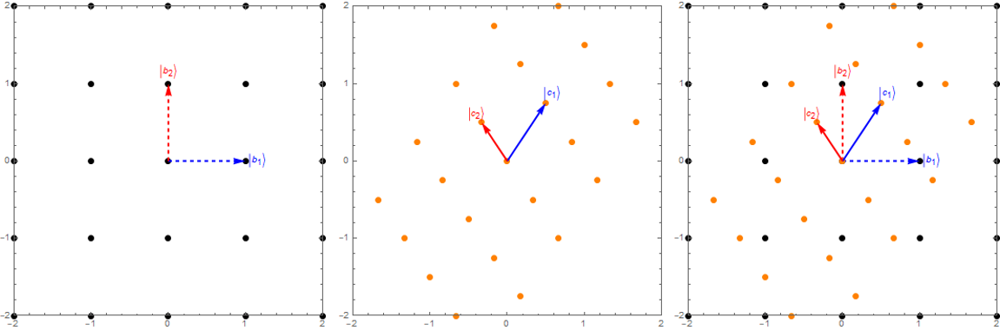

$\newcommand{\bra}[1]{\left\langle #1 \right|}$
$\newcommand{\ket}[1]{\left| #1 \right\rangle}$
$\newcommand{\braket}[3]{\left\langle #1 \middle| #2 \middle| #3 \right\rangle}$

# 5. Estrutura matemática da MQ (parte 2)

Nesta semana continuaremos a discutir a estrutura matemática da teoria quântica, complementando a discussão a respeito de transformações lineares e, em particular, mudanças de bases. Também iremos apresentar alguns casos importantes como os operadores projetores e o produto tensorial de espaços de Hilbert  . ... ==(NEEDS SOME WORK HERE!!)==

Para retornar aos tópicos das aulas anteriores, use o menu de navegação ou [clique aqui](../Aulas_S5-S6/).

## 5.7 Transformações lineares e mudanças de base

Na aula anterior nós discutimos como encontrar os autovetores de um operador. Surgiu, então, a questão se os autovetores do operador deveriam ser sempre ortogonais e poderiam formar uma base. Aqui, vamos iniciar esta discussão com a questão, geral, se os autovetores de um operador podem sempre formam uma base do espaço vetorial. Nos casos onde isso é possível, como construí-la?

Primeiro, vamos relembrar que condições um conjunto deve satisfazer para formar uma base. De maneira simples, para formar uma base do espaço (ou subespaço) um conjunto de autovetores devem satisfazer duas condições:

!!! info "Condições para formar uma base"
    1. Ser ortonormais.
    2. Satisfazer a relação de completeza.

Para ajudar a fixar esses conceitos, considere o seguinte exemplo.

!!! example "Exemplo"
    Considere o operador dado pela matriz

    $$
    Z = 
    \begin{pmatrix}
        1 & 0 \\
        0 & -1
    \end{pmatrix}
    $$

    Observe que seus autovalores são $\lambda_{1,2}=\pm 1$.
    
    Tendo como autovetores:

    $$
    \ket{u_1}=
    \begin{pmatrix}
        1 \\ 0
    \end{pmatrix}, \quad 
    \ket{u_2}=
    \begin{pmatrix}
        0 \\ 1
    \end{pmatrix}.    
    $$

    É fácil verificar que esse autovetores são ortonomais, portanto satisfazendo a primeira condição. 
    
    Agora, precisamos verificar se a segunda condição também é satisfeita. Ou seja, se o conjunto é completo. Para isso, fazemos:

    $$
    \ket{u_1} \bra{u_1} + \ket{u_2} \bra{u_2} =
    \begin{pmatrix}
        1 \\ 0
    \end{pmatrix}
    \begin{pmatrix}
        1 & 0
    \end{pmatrix}
    +
    \begin{pmatrix}
        0 \\ 1
    \end{pmatrix}
    \begin{pmatrix}
        0 & 1
    \end{pmatrix} \\
    =
    \begin{pmatrix}
        1 & 0 \\ 
        0 & 0
    \end{pmatrix}
    +
    \begin{pmatrix}
        0 & 0 \\ 
        0 & 1
    \end{pmatrix} = 
    \begin{pmatrix}
        1 & 0 \\ 
        0 & 1
    \end{pmatrix} = \mathbb{1}.
    $$ 
    
    Portanto, verificamos que a relação de completeza também é satisfeita. 
    
    A conclusão final é que, neste caso, os autovetores formam uma base. De faot, é fácil verificar que qualquer vetor de dimensão dois pode ser escrito numa expansão em termos do conjunto $\{ \ket{u_1},\ket{u_2} \}$.

    Seja, por exemplo, $\ket{\psi}$ um vertor arbitrário

    $$
    \ket{\psi} = 
    \begin{pmatrix}
        \alpha \\ \beta    
    \end{pmatrix} =
    \alpha
    \begin{pmatrix}
        1 \\ 0    
    \end{pmatrix} + 
    \beta
    \begin{pmatrix}
        0 \\ 1   
    \end{pmatrix} = \alpha \ket{u_1} + \beta \ket{u_2}.
    $$

### Forma diagonal

O operador $\hat{Z}$ é um exemplo de operador na forma diagonal.

!!! info "Representação diagonal"
    Um operador $\hat{A}$ está  na forma diagonal quando escrito

    $$
    \hat{A} = \sum_i \lambda_i \ket{u_i} \bra{u_i}
    $$

    onde os vetores $\ket{u_i}$ formam uma base ortonormal. Neste caso, a matriz $A$ tem a forma

    $$
    A = 
    \begin{pmatrix}
        \lambda_1 & 0         & \dots  & 0 \\
        0         & \lambda_2 & \dots  & 0 \\
        \vdots    & \vdots    & \ddots & \vdots \\
        0         & 0         & \dots  & \lambda_n
    \end{pmatrix}
    $$

    Um operador é dito _diagonalizável_ quando pode ser escrito na forma diagonal. A representação diagonal também é chamada de _decomposição ortogonal_. Nem todos os operadores de um espaço vetorial tem forma diagonal.

Na última aula, vimos também um exemplo em que

$$
M = 
\begin{pmatrix}
    1 & 2 \\
    1 & 0
\end{pmatrix}
$$

tem autovetores que não são ortonormais

$$
\ket{u_1} = \frac{1}{\sqrt{5}}
\begin{pmatrix}
    2 \\ 1
\end{pmatrix}, \quad
\ket{u_2} = \frac{1}{\sqrt{2}}
\begin{pmatrix}
    1 \\ -1
\end{pmatrix}  \Rightarrow \quad
\bra{u_1} u_2\rangle = \frac{1}{\sqrt{10}}.
$$

Será que é possível reescrever o operador $M$ numa forma diagonal? Aliás, qual seria o significado disso e quais propriedades tal operação deveria satisfazer, se existisse? Mais importante ainda, qual seria sua utilidade?  

Mais adiante veremos quais são as condições necessárias para um operador ser diagonalizável. Veremos também como fazer para diagonalizá-lo. Antes, vamos introduzir mais dois conceitos importantes. Os conceitos de _mudança de base_ e _transformações de similaridade_.

### Mudança de base

Para efeito de comparação e analogia, podemos pensar na mudança de base como algo parecido à mudança de sistema de coordenadas, com o qual já estamos acostumados na Física. 

Como sabemos, a representação de um vetor (ou operador), por exemplo, na forma matricial irá depender da base usada para representá-lo, pois em geral os valores das compenentes serão diferentes, mas isso não altera o significado de cada um desses objetos. 

Dado um vetor qualquer

$$
\ket{v} = \sum_i b_i \ket{b_i} = \sum_i c_i \ket{c_i},
$$ 

expresso nas bases $\{ \ket{b_i} \}$ e $\{ \ket{c_i} \}$, é sempre possível achar uma transformação de coordenadas que permita expressar as coordenadas $c_i$ desse vetor a partir das coordenadas $b_i$.

Para isso, basta encontrar a matriz (operador linear), $S$, que leva cada vetor $\ket{b_i}$  no correspondente vetor $\ket{c_i}$:

$$
\ket{c_i} = S \ket{b_i} \rightarrow \ket{b_i} = S^{-1} \ket{c_i}
\Rightarrow c_i = b_i (S^{-1}).
$$

Uma forma de pensar nisso é que a transformação $S$ leva os vetores da base $\ket{b_i}$ nos vetores da base $\ket{c_i}$. Neste caso, $S$ é efetivamente um mapa de como fazer essa transformação dos vetores da base, e é uma receita (mapa) de como "levar" cada ponto de um sistema de coordenadas no ponto correspondente no outro sistema de coordenadas. Na verdade, é importante lembrar que aqui estamos interessados nas coordenadas (representação) do vetor, que está sendo representado nas diferentes bases (sistemas de coordenadas).  

**Figura 1: _Efeito de uma tranformação linear (S) num grid de pontos e nos versores da base_**

Note, porém, que nessa interpretação todo o sistema de coordenadas é transformado. Ou seja, o _grid_ de pontos do espaço, onde cada ponto é espaçado pelos versores (vetores unitários) da base é transformado. Isso, em geral, representa "deformação" do espaço (mais estritamente, do grid de prontos representando o espaço). Se for linear, essa tranformação fará com que um conjunto de pontos igualmente espaçados continue igualmente espaçados, mas como eles podem sofrer uma mudança de escala, os comprimentos e áreas do _grid_ não são necessariamente conservados. Na verdade, pode-se demonstar que as áreas serão escaladas por uma fator exatamente igual ao determinante da matriz de transformação.

Como determinar a matriz de transformação?

Na verdade, é bem simples. Basta considerar o efeito nos vetores da base. Usaremos a Fig. 1, acima, para ilustrar com um exemplo que nos ajudará a entender o processo. Imaginando que estamos indo da base $\ket{b_i}$, com os vetores indicados pelas setas potilhadas, e cujas coordenadas são 

$$
\ket{b_1} = \begin{pmatrix} 1 \\ 0 \\ \end{pmatrix};  
\quad
\ket{b_2} = \begin{pmatrix} 0 \\ 1 \\ \end{pmatrix}
$$ 
 
os novos vetores da base $\ket{c_i}$ são dados por

$$
\ket{c_1}= 
\left(
\begin{array}{c}
 \frac{1}{2} \\
 \frac{3}{4} \\
\end{array}
\right);  
\quad
\ket{c_2}= 
\left(
\begin{array}{c}
 -\frac{1}{3} \\
 \frac{1}{2} \\
\end{array}
\right)
\Rightarrow \quad 
S = 
\left(
\begin{array}{cc}
 \frac{1}{2} & -\frac{1}{3} \\
 \frac{3}{4} & \frac{1}{2} \\
\end{array}
\right)
$$

Portanto, as colunas da matriz de transformação correspondem aos vetores transformados da nova "base" (agora não mais ortonormal).

Dada a matriz de transformação $S$, sabemos como todos os vetores do espaço se transformam, pois sabemos como os vetores da base se transformam. Assim,  podemos facilmente traduzir as coordenadas de uma base na outra, com facilidade. Mas como são transformados (ou representado) os operadores lineares de uma base para outra?

A resposta simples é, novamente, ver o efeito da ação sobre os vetores expressos nas duas representações (bases) e usar as relações de transformação entre os vetores das buas bases para expressar os elementos de matriz do operador na nova base.

Pode-se demonstrar (_verifique!_) que, se $L$ for a representação matricial de um operador $\hat{L}$ na primeira base $\ket{b_i}$, a sua representação matricial na segunda base será dada por

$$
\tilde{L} = S^{-1}L\,S.
$$

### Transformações de similaridade

Para simplificar a notação, vamos expressar os operadores por matrizes, mas o resultado discutido aqui é geral.

!!! info "Matrizes (transformações) similares"
    * Uma matriz $B$ é dita similar a uma matriz $A$ se $B = S^{-1}A\,S$ para qualquer matriz inversível $S$.
    * Se $B$ é similar a $A$, então $B$ tem os mesmo autovalores de $A$. Isso pode ser facilmente demonstrado (_verifique!_). 
    * Como consequência de ter os mesmos autovalores, as duas matrizes terão também o mesmo traço (soma dos autovalores) e determinante (produto dos autovalores).
    * Se a matriz $S$ for _unitária_ ela preservará normas e ângulos, de modo que se $A$ for uma representação do operador $\hat{A}$ numa base ortonormal, então $B$ também o será. Como sempre trabalhamos com bases ortogonais, estaremos interessados geralmente em transformações _unitárias_ de similaridade. 

Uma questão interessante agora é se seria possível, em geral, encontrar uma transformação $S$ que transforme os autovetores de uma matriz $M$, geral, de tal modo que a eles passem a formar uma base do espaço. Algo, por exemplo, inverso ao mostrado na Figura 1. Em outras palavras, será que é possível encontrar uma transformação de similiaridade $S$ que coloque a matriz $M$ numa forma diagonal (i.e., que diagonalize $M$)?

Como vimos, nesta formulação da MQ usamos operadores lineares para representar grandezas físicas observáveis. Nesse contexto, vimos que os autovalores do operador estão associados aos valores das medidas daquele observável. Portanto, é muito desejável preservar os autovalores de um operador que represente grandezas físicas, se quiseremos buscar tranformação que o diagonalize. Para esse efeito, portanto, usaremos transformações de similidares. Mas como encontrar tais transformações? Como diagonalizar $M$?

## 5.8 Diagonalização de operadores

Como estamos interessados e na diagonalização de operadores observáveis, vamos coniderar aqui uma operador Hermitiano $C$, qualquer, que representa uma dada grandeza física. Estamos interessados em escrever esse operador numa forma diagonal $D$, seguindo uma transformação de similiaridade $S$:

$$
D = S^{-1}C\,S.
$$

Como fazemos para encontrar a transformação $S$?

!!! info "Procedimento para encontrar a transformação S"
    1. Encontre os autovalore e autovetores da matriz $C$
    2. Normalize os autovetores de $C$
    3. Forme a matriz $S^{-1}$ de modo que as colunas dessa matriz sejam os autovetores (colunas) normalizados de $C$
    4. A matriz $S$ é a matriz inversa de $S^{-1}$, tal que $S^{-1}S=SS^{-1}=\mathbb{1}$.

Fica como um **exercício sugerido** demonstrar que este procedimento resulta na forma diagonal

$$
D =
\begin{pmatrix}
    \lambda_1 & 0         & \dots  & 0 \\
    0         & \lambda_2 & \dots  & 0 \\
    \vdots    & \vdots    & \ddots & \vdots \\
    0         & 0         & \dots  & \lambda_n
\end{pmatrix}
= \sum_i \lambda_i \ket{u_i} \bra{u_i}
$$

onde $\lambda_i$ são os autovalores de $C$ e $D$.

Será que esse procedimento funciona sempre? Não, nem sempre! Nem todas as matrizes são diagnalizáveis. Para isso algumas condições devem ser satisfeitas pela matriz $C$. Pode-se mostrar, porém, que toda matriz _normal_ é diagonalizável.
 

